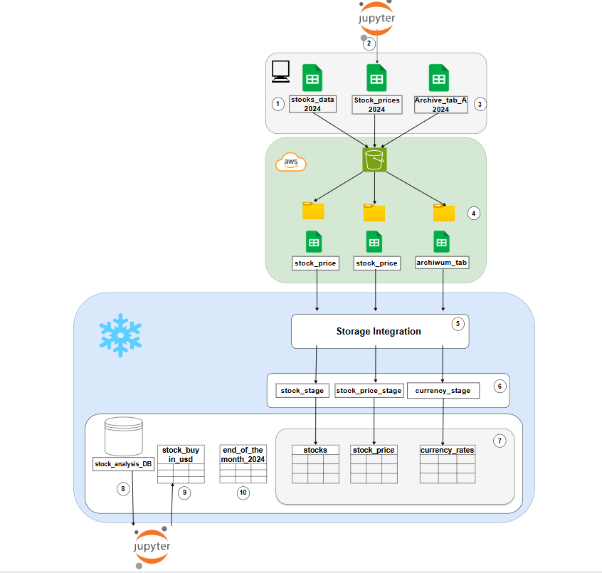

# Stock Data Project — 2024

## Project Goal  
This project focuses on collecting, storing, and analyzing stock market data and exchange rates for 2024.  

The main objectives are:  
- Calculate the **value of stock purchases in PLN** when transactions were originally made in USD.  
- Track **P&L (Profit and Loss)** in PLN using FIFO rules for USD transactions.  
- Support **Polish tax reporting**:  
  - Capital gains tax is **19%** in Poland.  
  - If 15% was withheld in the US, the remaining **4% difference** must be paid.  
  - Currency conversion is based on the **exchange rate from the business day before the purchase**.  
- Provide monthly and year-end valuation of stock positions.  

---

## Architecture  
The project integrates several components:  
- **Data sources**: broker extracts, stock prices from Yahoo Finance, and NBP exchange rate archives.  
- **AWS S3**: centralized storage for CSV files.  
- **Snowflake**: data warehouse for loading, storing, and querying.  
- **Jupyter Notebook**: environment for calculations in PLN, FIFO logic, and P&L analysis.  

---

---
## Project Objectives

The project is designed to address the following objectives:

1. Calculate the amount of tax to be paid in Poland based on investment profit  -> [Review sql query](https://github.com/Nadiia1998/Stock_market_analysis_project/blob/main/sql_snowflake_code/tax_calculation_pln.SQL);
2. Analyze how the portfolio value changes depending on month-over-month stock price fluctuations -> [Review sql query](https://github.com/Nadiia1998/Stock_market_analysis_project/blob/main/sql_snowflake_code/change_in_stock_price_MOM.SQl);
3. Provide additional valuable insights, including -> [Review sql query](https://github.com/Nadiia1998/Stock_market_analysis_project/blob/main/sql_snowflake_code/stock_analysis_query.SQL):  
   - Stock weight in the portfolio  
   - Total shares, total cost, and average cost per company  
   - Total spend (USD & PLN)  
   - Total portfolio value  
   - Monthly investment trend  
   - Earnings from non-invested funds  

 ---    
### 1. Download stock prices and export to CSV  
Daily stock prices (`open`, `close`) are downloaded using the **`yfinance`** library.  
Only tickers from the investment portfolio are included.  
Data is exported as `stock_prices_2024.csv`.  

---

### 2. `stock_data_2024.csv` — broker extract  
Contains all broker-provided transactions for 2024 (buy/sell, dividends, etc.).  
#####  [to look at the code](https://github.com/Nadiia1998/Stock_market_analysis_project/blob/main/jupyter_nothebook_code/stock_price_2024.ipynb)
---

### 3. Currency archive (NBP Table A, 2024)  
Used for USD→PLN conversion.  
- 19% capital gains tax in Poland.  
- If 15% withheld in the US, pay 4% difference.  
- Conversion rate = **day before purchase**.  

---

### 4. Upload CSV files to AWS S3  
Local files (`stock_prices_2024.csv`, `stock_data_2024.csv`, `archive_tab_A_2024.csv`) are uploaded into S3.

---

[Review a DDL query in 5–7 steps](https://github.com/Nadiia1998/Stock_market_analysis_project/blob/main/sql_snowflake_code/DDL_script.sql)

---

### 5. Create AWS–Snowflake Storage Integration  
Configure a **Snowflake storage integration** with IAM roles and policies to securely access S3 files.  

---

### 6. Create stages for CSV files  
Create an **external stage** for each dataset in Snowflake:  
- `stock_stage`  
- `stock_price_stage`  
- `currency_stage`  

---

### 7. Create tables and load data from stages  
Define Snowflake tables (`stocks`, `stock_price`, `currency_rates`) and load data via `COPY INTO`.  

---

### 8. Jupyter Notebook: PLN valuation with FIFO  
Jupyter Notebook connects to Snowflake to calculate **stock purchase value in PLN** when bought in USD.  
- Compute PLN spent when buying USD.  
- Apply **FIFO (First-In-First-Out)** to USD purchases.  
- Convert USD→PLN using the **exchange rate of the day USD was bought**.  
- Estimate final stock purchase value in PLN.  
##### [to look at the code](https://github.com/Nadiia1998/Stock_market_analysis_project/blob/main/jupyter_nothebook_code/calculate_price_per_stock_buy_in_usd.ipynb)
---

### 9. Store results in `share_analysis_DB`  
Save processed results (e.g., `stock_buy_in_pln`) back into Snowflake DB `share_analysis_DB`.  
This enables reporting and sharing.  

---

### 10. `end_of_the_month_2024` table  
Contains the last business day of each month in 2024.  
Used to filter and retrieve month-end stock prices (closing prices at month-end).  

---

- Centralized storage in AWS S3 and structured analysis in Snowflake.  
- Tools for monthly reporting and compliance with Polish regulations.  
